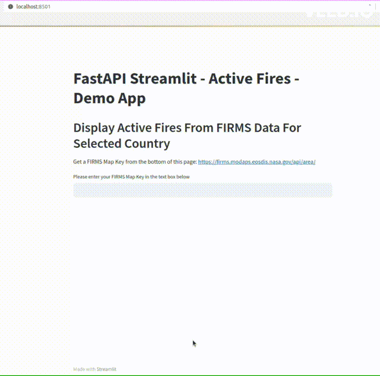
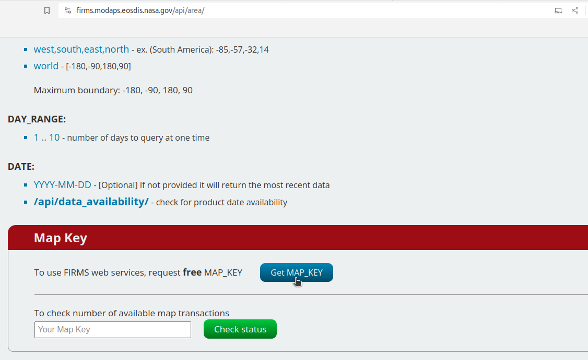

# Streamlit Folium and FastAPI - Active Fires (with FIRMS and Nominatim APIs)

A web-app map designed to display "Active Fires" points detected in the last 9 days for a given country. 

FIRMS API was used to query active fires data from the [FIRMS - Fire Information for Resource Management System](https://firms.modaps.eosdis.nasa.gov/) program from NASA, and Nominatim API was used to query the boundary of a selected country.



This project is a combination of the two previous Streamlit-FastAPI projects which were created to demonstrate how to use the [FIRMS API](https://github.com/enguy-hub/streamlit_fastapi_firms) and the [Nominatim API](https://github.com/enguy-hub/streamlit_fastapi_nominatim)


Follow the setup guide below to try it out. Enjoy !!!


## Setup Guide


### 1. Clone the repo

---

**HTTP**

```sh
git clone https://github.com/enguy-hub/streamlit_fastapi_activefires.git
```

**SSH**

```sh
git clone git@github.com:enguy-hub/streamlit_fastapi_activefires.git
```


### 2. Create and activate Python environment (conda or venv)

---

For `CONDA` environment (assuming conda or miniconda is already installed), run the following command at the root folder:

1. Create a conda environment from the `conda_env.yml` file:

   ```sh
   conda env create --file conda_env.yml
   ```

2. Activate the conda environment:

   ```sh
   conda activate stfapi
   ```

For `VENV` environment, perform the following commands at the root folder:

1. Create a python `venv` virtual environment:

   ```sh
   python -m venv venv
   ```

2. Activate the virtual environment:

   ```sh
   source venv/bin/activate
   ```

3. Install the dependencies:
   ```sh
   pip install -r requirements.txt
   ```

Source: <https://packaging.python.org/en/latest/guides/installing-using-pip-and-virtual-environments/>


### 3. Obtain the FIRMS API Map Key

Navigate to the following URL: <https://firms.modaps.eosdis.nasa.gov/api/area/>

Scroll down to the bottom of the page and click on "Get MAP KEY" --> Enter your email to get the Map Key




### 4. Run the FastAPI server

---

Run the following command at the root folder:

```sh
uvicorn api.main:app --reload
```

The server will be available at <http://127.0.0.1:8000/>


### 5. Run Streamlit app

---

```sh
streamlit run stfapi_activefires.py
```

The app will be available at <http://localhost:8501>


# Enjoy the app !!!

---


### Deactivate Python intepreter environment (conda or venv)

---

For `CONDA` environment, run the following command:

```sh
conda deactivate
```

For `VENV` environment, run the following command:

```sh
deactivate
```
